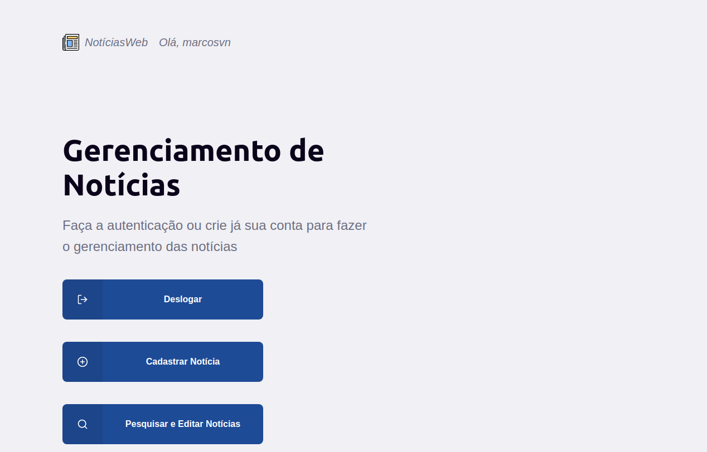
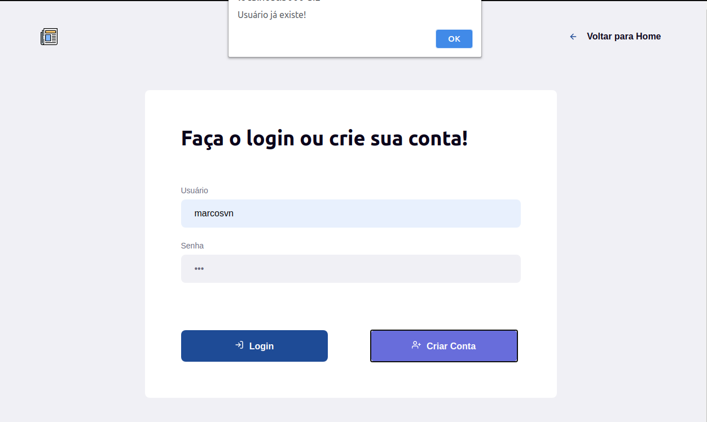
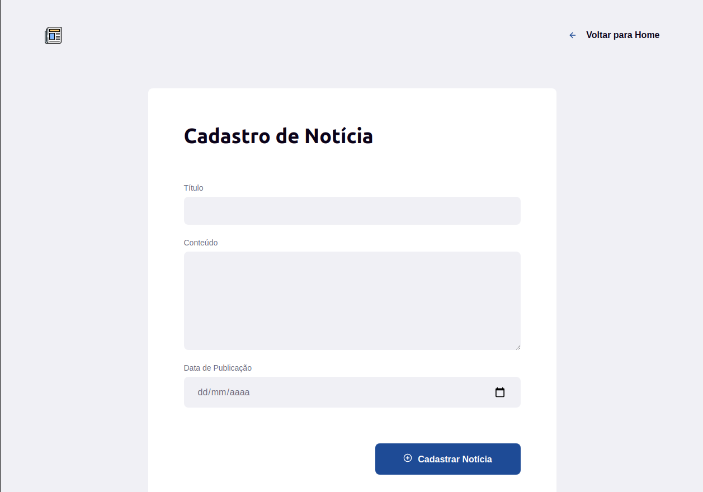
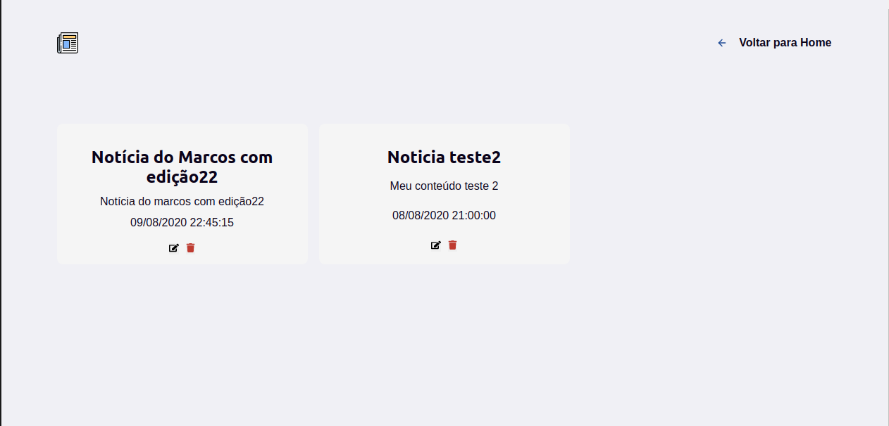

# O APP
- App web desenvolvido em ReactJS que permite o gerenciamento de notícias através da API desenvolvida em: https://github.com/MarcosVn/noticias-api, incluindo a integração da autenticação via JWT desenvolvida.

# Pré-requisitos
- [NodeJS] instalado 

# Stack utilizada no APP

- [ReactJS]
- [ReactRouter/ReactRouterDOM]
- [ReactIcons]
- [Axios]

# Instalar dependências
```sh
$ npm install
```

# Configuração
Em:
```sh
    .
    └── src
        ├── assets
        ├── pages
        └── services
            └── api.js
```

definir no _BASE_URL_ a porta em que a API está sendo executada: https://github.com/MarcosVn/noticias-api

# Execução 
No diretório do projeto, executar:

```sh
$ npm start
```

O app será executado em modo dev.<br />
Abrir [http://localhost:3000](http://localhost:3000)

# Exemplos de Tela

- Home:


- Login/Cadastro de Usuário:


- Cadastro de Notícias


- Listagem, edição, remoção



[NodeJS]: <https://nodejs.org/>
[ReactJS]: <https://reactjs.org/>
[ReactRouter/ReactRouterDOM]: <https://reactrouter.com/>
[ReactIcons]: <https://github.com/react-icons/react-icons>
[Axios]: <https://github.com/axios/axios>